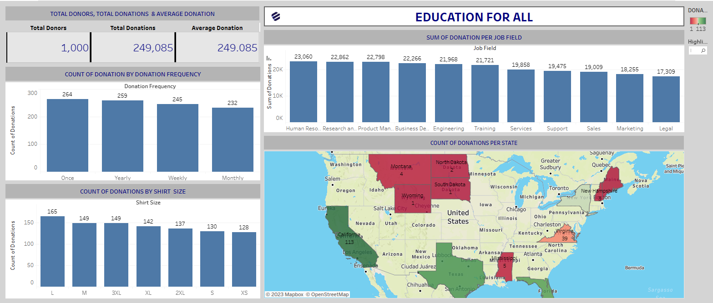

# FUNDRAISING STRATEGY

---

## INTRODUCTION

During the course of my internship at EntryLevel and after learning about relational databases and SQL, basic SQL functions, etc. A project was given.

The project is about a Charity organisation, **‘Education for All’** and am expected to perform the role of a Data Analyst. 

## ABOUT THE DATASET
Two datasets were provided, EFO_Donation_Data and EFO_Donor_Data.
- EFO_Donation_Data: This contains the following data, the donor’s id, first name, last name, gender, email address, job field, donation amount, state of residence (US) and t-shirt size.
- EFO_Donor_Data: This contains the following data, the donor’s id, frequency of donation, university attended, car make, second language, favourite colour and favourite movie genre.

## PROBLEM STATEMENT
Have been asked by the Head of Fundraising to present the data on donor insights and donation rates.

Within the Fundraising team, our objectives are to:
- Increase the number of donors in the database.
- Increase the donation frequency of the donors.
- Increase the value of donations in the database.

In two 	weeks, my team is having a fundraising strategy meeting for the following year, and I need to present insights from the donation data to inform my fundraising strategy and increase donations. 

## FIVE ‘WHYS’ APPROACH
With the business problem defined, Root Cause Analysis was used to get deeper into the ‘why’ of the business problem. This is done with the five why’s approach, by simply asking ‘why’ five times.

It is also called the Root Cause Analysis, developed by Sakichi Toyota, founder of Toyota Industries.	

Q1: Why is a Fundraising strategy needed?
A: To improve on the existing fundraising strategy.

Q2: Why do we need to improve on the existing fundraising strategy?
A: To increase the number of donors from each state.

Q3: Why do we need to increase the number of donors in each state?
A: To prevent great variation in the amount of donations from each state.

Q4: Why do we need to prevent the great variation in the amount of donations from each state?
A: Donations from some states were more than others in a great way.	

Q5: Why were donations from some states more than that of others in a great way?
A: The number of donors in some states are less compared to other states.

## INSIGHTS FROM THE DATASET

- The total number of donors, total amount of donations and the average donations.
- The sum of donations by job field.
- The count of donations by donation frequency.
- The count of donations per donor shirt size.
- The count of donations per state.

## VISUALISATION(DASHBOARD) OF THE INSIGHTS ABOVE

Here is the link to the visualization for interaction

([https://public.tableau.com/app/profile/sherif.atanda/viz/My_Port_Folio_Task3/My_Port_Folio_Task])

## IMPORTANT FINDINGS 

1. Presence of outliers: From the map, the count of donations from each state also provides information about the number of donors.
	Looking at the top five (5) states (California, Texas, Florida, New York and Virginia) with the highest count of donations and the bottom five (5) states with the lowest count of donations (Wyoming, South Dakota, North Dakota, Maine, New Hampshire). The reason is due to the greater and lesser number of donors in the respective states. 

2. The average donations made from donors who gave monthly and yearly exceeded the average donation. 

## RECOMMENDATIONS TO SOLVE THE BUSINESS PROBLEM

1. The Organization should find ways to increase the number of donors from the following states so that not only the donors will increase but the amount of donations also.

2. Looking at the bar chart that provides information about the count of donations per shirt size. With this chart, the organization should present gifts to donors with their respective size with the logo of the organization on it.
	This is to appreciate the donors, make them see themselves as a part of something great, motivate them to do more and publicize the organization to people who are likely to become new donors.

## CONCLUSION
Looking at the project, the steps taken were consecutive. Having defined what, the objectives and expectation of the organization are, I took the following steps;
- Familiarize myself with the datasets.
- Found some helpful insights.
- Used SQL to communicate with database and extracted the insights using queries.
- Exported the insights as a CSV file.
- Imported them into tableau to make visualization and created an interactive dashboard.
	At first when I read the objectives of the fundraising team, I asked myself how do I want to provide solutions to them. But I later discovered that the answers were in the datasets. I just needed to familiarize myself with the datasets and get insights on solving the business problem.
